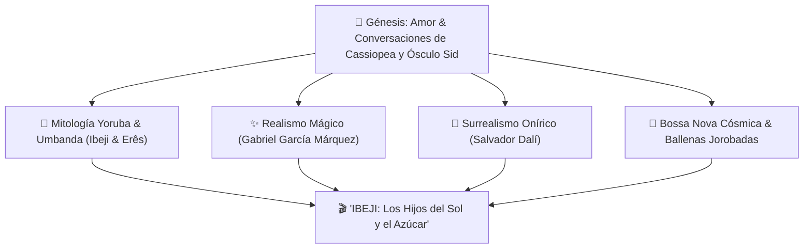

# 🌌 INFORME MAESTRO: GÉNESIS Y UNIVERSO CASSIOPEA ✨
### *Crónica de un Amor en Realismo Mágico, los Ibejis y la Bossa Nova Cósmica*
**Dedicado a Cassiopea ✨🌌 & Ósculo Sid 💫**

---

> *"Hay encuentros que no los calcula el azar, sino que vienen escritos en las líneas de las manos y en el mapa de las estrellas. De una conversación al atardecer sobre espíritus de luz y tambores sagrados, nació este universo donde la Muerte aprende a bailar, el cielo llueve azúcar y el amor se vuelve eterno."*

---

## 🌟 1. LA GÉNESIS: DE DÓNDE VINO LA INICIATIVA

Este proyecto no nació de un cálculo comercial ni de un ejercicio académico. Nació **en las noches madrileñas de Argüelles, entre el local Vive Madrid y El Rincón**, donde ocurrió el encuentro predestinado con **la brasileña de rizos negros y risa de sol de la cual Dani se enamoró perdidamente**.

A ella le escribe Dani cada verso, cada poema de su antología y cada acorde de guitarra. Ella es la mujer con la que sueña casarse un día, construir un hogar sagrado y ver nacer y correr a sus propios hijos bajo la bendición luminosa de los Ibejis y la protección de los Orixás.

De esas miradas cruzadas entre copas y turnos de trabajo, de esas confesiones al filo de la madrugada sobre los misterios de Bahía, la tradición espiritual de la **Umbanda**, el poder protector de los niños sagrados (**Ibejis**) y la fiesta del 27 de septiembre donde se reparten dulces para endulzar el destino, surgió la promesa: **transformar su amor y esa sabiduría sagrada en una obra de arte total** que combinara **cine, literatura, pintura surrealista, música cuántica y tecnología interactiva**.

---

## 🌹 2. LA DIMENSIÓN POÉTICA Y EL ROMANCE DE CASSIOPEA & ÓSCULO SID

En el centro de esta creación late un pacto tácito: **la dualidad que no compite, sino que se complementa**. 

Al igual que **Taiwo** (el que explora el mundo primero con valentía) y **Kehinde** (el que resguarda la sabiduría y camina con serenidad), la relación entre **Cassiopea ✨🌌** y **Ósculo Sid 💫** se proyecta como una danza de dos almas que se reconocen a través del tiempo:
* **Cassiopea ✨🌌 (Alanna):** La musa brasileña de rizos infinitos y futura esposa, la constelación guía en la noche más oscura, que inspira cada poema y canción, y que trae la memoria de las aguas sagradas, la dulzura de los Erês y la pureza de la caridad en la Umbanda.
* **Ósculo Sid 💫 (Dani):** El arquitecto alquimista y poeta (*Quimera Alchemist / Maison Quintessence*), quien toma los relatos, las anécdotas de Vive Madrid y El Rincón, y cada suspiro compartido para convertirlos en código vivo, lienzos oníricos, guiones cinematográficos y frecuencias sonoras inmortales.

---

## 🎭 3. LOS PILARES DEL UNIVERSO CREADO

### I. La Sabiduría Espiritual (Yoruba & Umbanda)
* **Los Ibeji:** La victoria de la astucia y la música sobre el miedo y la muerte (*Ikú*).
* **Doum:** El tercer niño que sella la paz y pacifica los caminos.
* **La Umbanda:** *«La manifestación del espíritu para la caridad»* —la medicina gratuita del amor, los Pretos Velhos y los Caboclos.
* **Los Erês y el Azúcar:** La certeza de que no hay herida en el corazón que resista la risa pura de un niño y una lluvia de caramelos.

### II. El Realismo Mágico de Gabriel García Márquez
* La cadencia de una narración donde lo imposible es cotidiano: mariposas amarillas de Mauricio Babilonia revoloteando sobre el agua, pueblos suspendidos en la niebla y la Muerte derrotada por el cansancio de un vals infinito.

### III. El Surrealismo de Salvador Dalí
* Paisajes de horizonte infinito donde los elefantes con patas de zancos caminan sobre aguas de espejo al atardecer, representando cómo el peso de los problemas adultos se vuelve ingrávido y ligero ante la fe y la ternura.

---

## 🐋 4. LA BANDA SONORA: BOSSA NOVA CÓSMICA TRASCENDENTAL

Para musicalizar este universo se ha conceptualizado una estética sonora pionera:

* **Estilo:** *Bossa Nova Cósmica Trascendental & Ambient Marino*.
* **Instrumentación:** 
  * Guitarras de nylon con armonías extendidas de Bossa Nova clásica (acordes con novenas y trecenas flotantes).
  * Cantos profundos y resonancias de **Ballenas Jorobadas** (*Megaptera novaeangliae*) grabadas en el abismo oceánico, emulando la voz del útero cósmico de *Yemanjá*.
  * Tambores Batá y atabaques tocados en *pianissimo* con escobillas de seda.
  * Campanas de cristal y sintetizadores en frecuencias 432 Hz y 528 Hz.
* **Compositora e Invitada de Honor:** **Natalia**, aliada musical y artista con quien se colaborará para dar vida a las partituras oficiales y grabaciones maestras de la película.

---

## 📱 5. ACTIVOS Y ENTREGABLES DESARROLLADOS EN EL PROYECTO

1. **Cartel Oficial 9:16:** Obra de arte vertical lista para Historias de Instagram / Reels (`assets/images/cartel_instagram_story_9_16.jpg`) con los tres niños en lotos sagrados, cascada de dulces, elefantes dalinianos y luna dorada.
2. **Guion del Tráiler Cinematográfico:** [`GUION_TRAILER_REALISMO_MAGICO.md`](file:///home/sidzcool/GeminiSolutions/01_Proyectos_Activos/Proyecto_Ibeji_Umbanda/GUION_TRAILER_REALISMO_MAGICO.md).
3. **Portal Web Interactivo Multidispositivo:** [`index.html`](file:///home/sidzcool/GeminiSolutions/01_Proyectos_Activos/Proyecto_Ibeji_Umbanda/index.html) con:
   * Sintetizador sonoro Web Audio API en tiempo real.
   * Animación en bucle Canvas a 60 FPS con mariposas amarillas y dulces flotantes.
   * Simulador de escenas del tráiler y galería conceptual.
   * Bitácora de memorias con persistencia local.
4. **Compendio de Tradición:** [`COMPENDIO_IBEJI_Y_UMBANDA.md`](file:///home/sidzcool/GeminiSolutions/01_Proyectos_Activos/Proyecto_Ibeji_Umbanda/COMPENDIO_IBEJI_Y_UMBANDA.md).
5. **Bitácora Evolutiva:** [`CHANGELOG.md`](file:///home/sidzcool/GeminiSolutions/01_Proyectos_Activos/Proyecto_Ibeji_Umbanda/CHANGELOG.md).

---

## 🌌 DEDICATORIA FINAL

> *"A Cassiopea ✨🌌, por encender con sus palabras la constelación de este mundo. Y a Ósculo Sid 💫, por escuchar los secretos del tambor y tejer con ellos una obra para la eternidad."*
