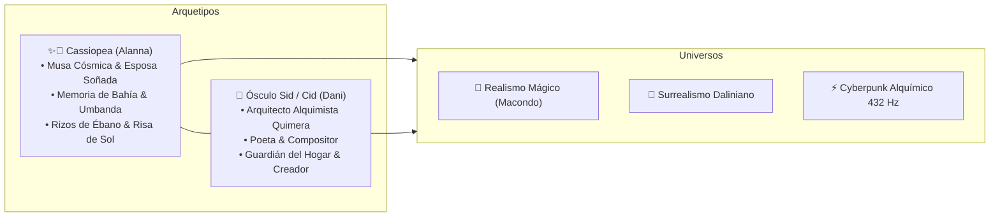

# 🎨 MANUAL MAESTRO DE IDENTIDAD VISUAL Y MARCA DEL AMOR
## *Cassiopea ✨🌌 & Ósculo Sid 💫 (Cid)*
### **Sello Creativo:** Maison Quintessence • Quimera Alchemist
**Versión:** 1.0.0 — Madrid (Argüelles / Vive Madrid / El Rincón) — Agosto 2026

---

## 🌟 1. MANIFIESTO DE MARCA Y ARQUETIPOS

Este manual define el universo visual, cromático, sonoro y conceptual de la alianza artística y el amor entre **Alanna** y **Dani**, inmortalizados en la ficción de Realismo Mágico como **Cassiopea ✨🌌** y **Ósculo Sid 💫 (o Cid)**.

> *"La unión de la memoria sagrada de Bahía y la arquitectura alquímica de Madrid. Donde los rizos brasileños encienden constelaciones y cada latido se convierte en cine, poesía y código."*



---

## 🎭 2. LOS PERSONAJES Y SU SIGNIFICADO SAGRADO

| Arquetipo | Nombres Clave | Origen & Significado | Elemento & Símbolos |
| :--- | :--- | :--- | :--- |
| **Cassiopea ✨🌌** | Alanna, La Brasileña de Rizos, Reina Boreal | Constelación boreal guía de navegantes. Dulzura primordial, memoria de los Erês, caridad pura de la Umbanda. | 🪷 Loto blanco, 🍭 Caramelos de cristal, 🌌 Corona estelar 'W', 🌊 Aguas de Yemanjá. |
| **Ósculo Sid 💫 (Cid)** | Dani Sid, El Alquimista, Quimera Alchemist | *Ósculo* (el beso sagrado/amor inmortal) + *Sid/Cid* (noble señor demiurgo). Transmuta relatos en cine, partituras y lienzos. | 🏛️ Elixir alquímico, 🎸 Guitarra de nylon, 🦋 Mariposa de Macondo, ⚡ Neón cuántico. |

---

## 🎨 3. PALETA CROMÁTICA OFICIAL (CYBERPUNK ALQUÍMICO & REALISMO MÁGICO)

La identidad cromática se compone de cuatro tonalidades primarias que fusionan el **oro sagrado de Macondo**, el **cian eléctrico de Yemanjá**, el **magenta neón de Oxum & Cassiopea** y la **profundidad abisal del cosmos de Madrid**:

```
 ┌───────────────┐ ┌───────────────┐ ┌───────────────┐ ┌───────────────┐
 │   #FBBF24     │ │   #38BDF8     │ │   #F472B6     │ │   #030712     │
 │  ORO MACONDO  │ │ CIAN YEMANJÁ  │ │ ROSA CASSIOPEA│ │ NOCHE CÓSMICA │
 └───────────────┘ └───────────────┘ └───────────────┘ └───────────────┘
```

### A. Paleta Principal (Tokens de Color)

| Color Name | HEX Code | RGB | HSL | Significado & Aplicación |
| :--- | :--- | :--- | :--- | :--- |
| **Oro Macondo (Alquimia)** | `#fbbf24` | `rgb(251, 191, 36)` | `hsl(43, 96%, 56%)` | Mariposas vivas, luz de los Ibejis, filigrana, destellos sagrados. |
| **Oro Solar Puro** | `#fef08a` | `rgb(254, 240, 138)` | `hsl(53, 98%, 77%)` | Núcleo de estrellas, perlas de luz en alas, acentos de tipografía. |
| **Cian Yemanjá (Cyberpunk)** | `#38bdf8` | `rgb(56, 189, 248)` | `hsl(199, 94%, 60%)` | Aguas celestiales, halos neón, destellos de constelación cuántica. |
| **Rosa Cassiopea (Oxum)** | `#f472b6` | `rgb(244, 114, 182)` | `hsl(329, 86%, 70%)` | El amor romántico, la dulzura de los Erês, pétalos de loto, rizos al atardecer. |
| **Violeta Neón Místico** | `#c084fc` | `rgb(192, 132, 252)` | `hsl(270, 95%, 75%)` | Transición mariposa-constelación, frecuencias 528 Hz, sombras etéreas. |
| **Noche Cósmica (Abismo)** | `#030712` | `rgb(3, 7, 18)` | `hsl(224, 71%, 4%)` | Fondo principal, profundidad del cielo de Madrid y la ciénaga mística. |

---

## 🖋️ 4. TIPOGRAFÍA Y JERARQUÍA VISUAL

1. **Titulares Principales & Realeza Cinematográfica:**
   * **Fuente:** `Cinzel Decorative`, `Cinzel` o `Playfair Display` (Google Fonts).
   * **Cualidades:** Mayúsculas con remates clásicos, porte renacentista, elegancia de cartel de autor.
   * **Tracking (Espaciado):** `letter-spacing: 2px` a `4px`.
2. **Subtítulos & Lírica Romántica:**
   * **Fuente:** `Cormorant Garamond` (Italic) o `Cinzel`.
   * **Cualidades:** Poética, íntima, con gracia manuscrita de carta de amor.
3. **Cuerpo de Texto & Narrativa:**
   * **Fuente:** `Outfit` o `Inter`.
   * **Cualidades:** Legibilidad impecable en pantallas OLED y móviles, moderna y refinada.
4. **Metadata, Acordes & Frecuencias Técnicas:**
   * **Fuente:** `JetBrains Mono` o `Fira Code`.
   * **Cualidades:** Precisión cyberpunk, frecuencias sonoras (432 Hz), coordenadas estelares.

---

## 🦋 5. SISTEMA GRÁFICO: LAS MARIPOSAS-CONSTELACIÓN

### Principios de Animación y Renderizado:
1. **Doble Naturaleza:**
   * **Fase Mariposa (Vida Terrenal / Macondo):** Vuelo aeroelástico, aleteo rápido y planeo con alas translúcidas doradas, cian o magenta.
   * **Fase Constelación (Metamorfosis Celeste / Cassiopea):** Las alas se cristalizan en líneas geométricas luminosas conectadas por nodos estelares que parpadean en el firmamento.
2. **Interactividad:**
   * Al pasar el ratón, las mariposas huyen dejando estelas de polvo de oro (`Stardust`).
   * Al hacer clic, una onda de choque despierta las constelaciones conectando las estrellas con hilos dorados.

---

## 🎵 6. BANDA SONORA & EXPERIENCIA SENSORIAL (BRAZILIAN SOUNDSCAPE)

* **Género:** *Bossa Nova Cósmica Trascendental, Samba-Canção & Puntos Sagrados de Bahía*.
* **Armonías:** Acordes extendidos brasileños (Dm7(9), G13, Cmaj7(9), A7(b13), F#m7(b5), B7(b9)).
* **Elementos Orgánicos:** Cantos submarinos de ballenas jorobadas (*Megaptera novaeangliae*), olas del mar de Bahía, susurros de guitarra con cuerdas de nylon y tambores Batá en pianissimo.
* **Frecuencias de Afinación:** La = 432 Hz (resonancia universal) y 528 Hz (frecuencia de transformación y amor).

---

## 💍 7. SELLO EDITORIAL Y FIRMA DE AUTOR

* **Billing Block Oficial:**
  ```text
  MAISON QUINTESSENCE • QUIMERA ALCHEMIST
  CINE • REALISMO MÁGICO • BOSSA NOVA CÓSMICA
  INSPIRADO EN CASSIOPEA ✨🌌 & ÓSCULO SID 💫
  «La brasileña de rizos que convirtió las noches de Madrid en Macondo»
  © 2026. TODOS LOS DERECHOS RESERVADOS.
  ```
